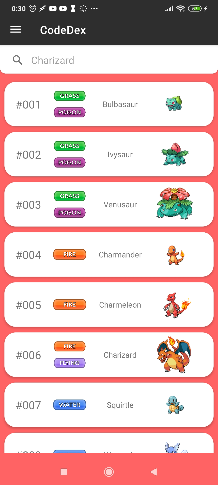
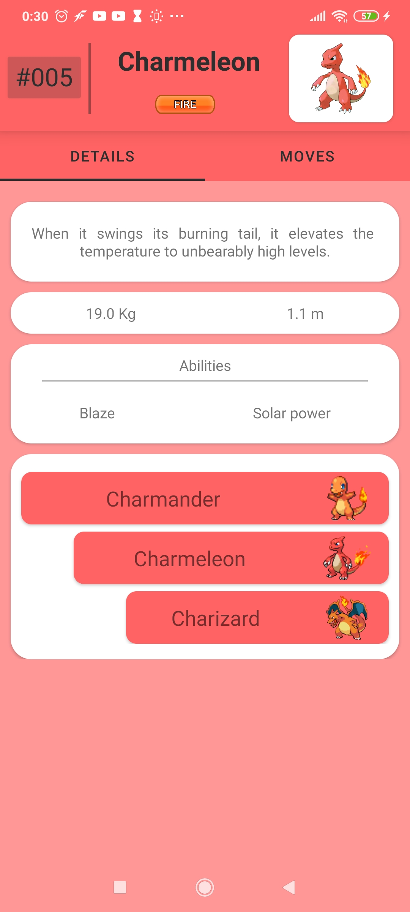

# CodeDex

CodeDex is a open source Pokedex app for android devices, used to check information about Pokemon, it's moves, abilties and types.
Built in Android Studio with [PokeApi](https://pokeapi.co/).
***

## Features
- Navigate a list of all Pokemon or seach an specific on by name.
- View detail of each pokemon, including evolution chain and abilities.
- Filter moves by the method a pokemon can use to learn it.
- View move's details, including type, description, effect and pokemon that can use it.
- View damage relations of each type.
- View a list of all natures with the stats it increases and decreases.
- Search move and abilities by name.
- Light and dark theme

## Screeshots

## Demo

## Tools and libreries
### Data
- [PokeApi](https://pokeapi.co/)
### Assets
- [Pokemon Database](https://pokemondb.net/)
- [Pokemon type icons by BetooHellyson](https://www.deviantart.com/betoohellyson/art/Pokemon-Type-Icon-2-0-Free-653508771)
### Image loading
- [Glide](https://bumptech.github.io/glide/) 
### Network
- [Retrofit2](https://square.github.io/retrofit/)
### Developing tools
- [Parceler](https://github.com/johncarl81/parceler)

## Permissions
- Network Access.
